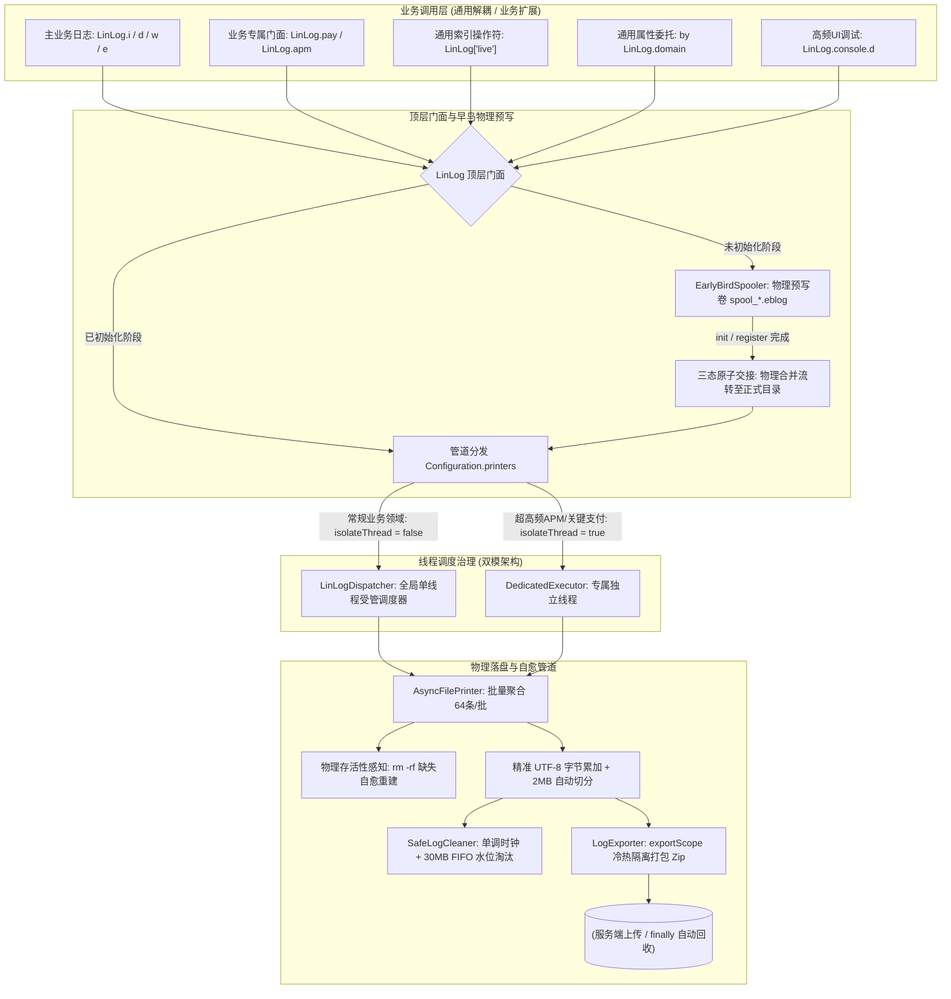

# LinLog - 现代高性能 Android 日志基础组件

[](https://kotlinlang.org)
[](https://developer.android.com)
[](https://opensource.org/licenses/Apache-2.0)

`LinLog` 是专为 Android 打造的高性能、防丢失、全领域物理隔离、双模线程调度的通用开源日志基础设施。

彻底摒弃传统方案中单条 I/O 阻塞、高频 GC 抖动、多模块日志踩踏、冷启动崩溃早鸟日志蒸发、多线程爆炸、外部手动删除目录断流等痛点，提供基于 **全域物理早鸟预写卷**、**双模线程受管调度（共享池 vs 独立专线）**、**协程 Channel 批量落盘**、**不可变单调时钟防篡改** 与 **冷热物理隔离导出** 的工业级解决方案。

---

## 一、核心架构特性与第一性原理

### 1. 🐣 全域物理早鸟预写卷 (Universal Early-Bird Spool & 0 内存蒸发)
- **冷启动第 0 毫秒物理在盘**：突破传统方案仅在 RAM 暂存的弊端，无论主通道还是任意子领域，在 `Application.<init>` 或 `attachBaseContext` 产生的第一行日志直接落入物理预写卷文件（`spool_${domain}_*.eblog`），遭遇 Native Crash、JVM 崩溃或系统 LMK 绝不蒸发。
- **0 侵入沙盒自省**：利用系统自省机制免 Context 定位私有存储沙盒，无需等待主线程初始化。
- **三态原子交接（Atomic State Handover）**：配置激活时通过原子状态机平滑完成预写卷到正式目录的物理灌流与交接，**0 孤儿日志丢失，时序严格递增**。

### 2. ⚡ 双模线程受管调度架构 (Shared Pool vs Isolated Thread)
针对不同业务领域的主客态与服务质量（QoS）差异，提供动态线程治理能力：
- **共享池模式 (`isolateThread = false`，默认)**：全库无论开立多少个领域桶，后台默认**严格复用全局单一受管写线程 (`LinLog-AsyncWriter`)**，避免多桶场景下的线程膨胀与 1MB 栈内存浪费，消除闪存写放大（Write Amplification）。
- **独立专线模式 (`isolateThread = true`，按需声明)**：超高频采样 APM 或核心支付领域可显式声明独占专属后台线程，**彻底物理隔离慢 I/O 挂起与高频数据冲击，杜绝内存积压与调度饥饿**。

### 3. 🚀 极致性能与削峰填谷 (Zero-Blocking & Zero-GC)
- **协程 Channel 异步管道**：主调用线程 `trySend()` 纯内存非阻塞入队，单条耗时仅 **~1.2 微秒**。
- **批量聚合落盘**：后台专用写线程单次批量聚合消费最多 64 条日志，配合 16KB `BufferedWriter` 内存缓冲合并 I/O，10,000 条日志异步落盘仅需 **0.29 ms**。
- **精准 UTF-8 物理字节计算**：无额外堆内存分配计算字符编码字节增量，修复字符与字节混淆问题，保证 2MB 轮转绝对精准。
- **内联短路懒求值 (`inline () -> String`)**：日志级别未达到门槛时闭包 100% 不执行，**0 闭包分配、0 临时字符串构建开销**。

### 4. 🛡️ 纯粹通用开源架构与领域物理隔离 (Domain Segregation)
- **开源纯粹性**：SDK 底层 100% 领域无关，彻底剥离具体业务名词硬编码，业务层可自由接入任意多领域。
- **现代化操作符与通用委托**：支持 `LinLog["domain"]` 索引访问与 `by LinLog.domain("domain")` 懒加载委托，**0 额外 Class 生成、0 冗余对象分配**。
- **物理多管道隔离**：各领域拥有独立的 Channel 缓冲、独立的文件滚动与容量淘汰策略，杜绝日志踩踏。

### 5. 🩺 物理存活性感知自愈 (Physical Liveness & Self-Healing)
- 克服 Linux 系统已打开文件描述符在被外部删除（`rm -rf`）后写入不抛异常的内核特性。
- 底层具备物理存活性与目录校验，一旦发现文件或父目录在磁盘上缺失，立即自动关闭死句柄并在 1 微秒内原地自愈重建目录与新文件，保障写入流永不断流。

### 6. ⏰ 防系统时间篡改与单调时钟安全清理 (SafeLogCleaner)
- 基于 `SystemClock.elapsedRealtime()` 单调物理时钟构建时间锚点，彻底免疫用户将系统时间拨至未来导致的历史日志被误清空。
- **30MB 物理容量硬顶 + 70% 水位 FIFO 淘汰 + 低存储空间紧急熔断**三重兜底。

### 7. 🚨 崩溃现场同步阻塞落盘 (Crash-Safe Flush)
- 提供 `flushSync(timeoutMs)` 与 `flushAllSync(timeoutMs)`，在 `UncaughtExceptionHandler` 触发时强行阻塞排空缓冲区，保全最关键的崩溃现场信息。

### 8. 📦 冷热物理隔离导出与自动生命周期安全 (LogExporter)
- 导出时底层自动抽干全域内存缓冲，仅打包归档冷文件，热日志持续无阻写入。
- 提供 `exportScope` 挂起函数，在业务上传闭包退出后自动在 `finally` 中物理删除临时 Zip，全链路 0 存储泄露。

---

## 二、系统架构全景图



---

## 三、快速接入与完整实战指南

### 1. 异步子线程初始化与领域注册（0 主线程依赖）

可在后台协程、子线程或冷启动异步任务中静默执行，主线程 0 阻塞：

```kotlin
// 在 Background Coroutine 或 Worker 线程中执行
CoroutineScope(Dispatchers.IO).launch {
    // 1. 全局默认主日志初始化（早鸟预写卷自动平滑合并至 default 目录）
    LinLog.init(applicationContext, isDebug = BuildConfig.DEBUG) {
        tag = "AppMain"
        maxFileSize = 2 * 1024 * 1024L // 精准 2MB 物理大小切分
    }

    // 2. 注册【高频 APM 领域】：开启独立专线线程，物理隔离防积压，0 栈回溯
    LinLog.register("apm") {
        tag = "Performance"
        isolateThread = true // 💡 独占独立线程，彻底杜绝慢 I/O 级联感染与内存积压
        stackTraceDepth = 0   // 0 栈回溯开销
        fileBufferCapacity = 4096
        maxKeepDaysMillis = 1 * 24 * 3600 * 1000L // 仅保留 1 天
        fileMinLevel = LogLevel.DEBUG
    }

    // 3. 注册【核心支付领域】：走默认共享调度器，超长保留 30 天
    LinLog.register("pay") {
        tag = "PAYMENT"
        // isolateThread 默认为 false，与主日志共用全局后台写线程，节约系统资源
        maxKeepDaysMillis = 30 * 24 * 3600 * 1000L
        fileMinLevel = LogLevel.INFO
    }
}
```

### 2. 业务层最佳调用实践（推荐方式）

#### 最佳实践：在业务模块中集中声明强类型扩展（类型安全、IDE 补全、0 额外 Class）
在业务 App 的公共模块建立 `LogDomains.kt`：

```kotlin
// LogDomains.kt (业务层集中管理，避免字符串散落)
package com.yourcompany.app.log

import com.lin.log.LinLog
import com.lin.log.LinLogger

inline val LinLog.apm: LinLogger get() = get("apm")
inline val LinLog.pay: LinLogger get() = get("pay")
inline val LinLog.live: LinLogger get() = get("live")
```

#### 业务组件中使用：
```kotlin
// 1. 常规业务调用（内联短路，0 性能损耗）
class PaymentActivity : AppCompatActivity() {
    fun onPaySuccess() {
        LinLog.pay.i("Order payment success")
    }
}

// 2. 超高频场景（如 60 FPS 渲染监控）：类内持有单例引用（0 哈希查找、0 委托开销）
class FrameTracker {
    private val apm = LinLog.apm

    fun onFrameRendered(costMs: Long) {
        if (costMs > 16) {
            apm.d { "Jank detected! Cost: ${costMs}ms" }
        }
    }
}

// 3. 懒加载属性委托调用（0 额外 Class 生成）
class LiveRoomManager {
    private val liveLogger by LinLog.domain("live")

    fun enterRoom(roomId: String) {
        liveLogger.i { "Enter room: $roomId" }
    }
}

// 4. 索引操作符调用
LinLog["rtc"].w("RTC peer disconnected")

// 5. 业务层扩展属性调用（结合上面声明的 inline val LinLog.apm / net 等）
LinLog.apm.w(id, "Watcher 远程/本地配置为 null，跳过初始化", true)
LinLog.net.i("Request finish")
LinLog.track.i("click_event")
```

### 3. 全级别对称多态重载规范（v / d / i / w / e）

LinLog 为 Android 每个日志级别（`v`, `d`, `i`, `w`, `e`）提供绝对对称的重载矩阵，彻底告别位置参数传参失败：

| 调用形态 | 语法示例 | 适用场景 |
| :--- | :--- | :--- |
| **基础文本** | `LinLog.w("系统低电量")` | 单纯记录文本，默认落盘 |
| **自定义 Tag** | `LinLog.apm.w(id, "配置为空，跳过初始化", true)` | **位置参数直接传 `toFile`，0 异常强绑定** |
| **纯异常上报** | `LinLog.e(throwable)` | 自动提取 `throwable.message` 作为日志正文 |
| **文本 + 异常** | `LinLog.w("支付握手超时", exception)` | 记录业务说明并完整保留堆栈跟踪 |
| **四元完整组** | `LinLog.e("OrderTag", "关闭订单失败", exception, true)` | 指定自定义 Tag、文本、异常与落盘开关 |
| **内联短路 Lambda** | `LinLog.apm.d { "渲染耗时: ${calcCost()}ms" }` | 避免无谓字符串拼接，级别未达标 0 开销 |
| **Tag + Lambda** | `LinLog.i("UserApi") { "获取到用户信息: $user" }` | 携带自定义 Tag 的零开销 Lambda |
| **异常 + Lambda** | `LinLog.e(exception) { "恢复状态发生严重异常" }` | 携带异常并附带动态构造的错误上下文 |
| **JSON 美化输出** | `LinLog.json(jsonStr, tag = "UserApi")` | 自动格式化排版缩进，默认等级为 DEBUG |


### 3. 极早冷启动直写与 Crash 现场同步落盘

```kotlin
class MyApplication : Application() {

    override fun attachBaseContext(base: Context) {
        super.attachBaseContext(base)
        // 🚀 冷启动第 0 毫秒早鸟直写：自动进入物理预写卷，Crash 绝不丢日志
        LinLog.i("AttachBaseContext invoked")
        LinLog["apm"].i("APM early monitor starting")
    }

    override fun onCreate() {
        super.onCreate()

        // 🚨 崩溃守护：强行同步阻塞排空落盘
        val defaultHandler = Thread.getDefaultUncaughtExceptionHandler()
        Thread.setDefaultUncaughtExceptionHandler { thread, throwable ->
            try {
                LinLog.e("CRASH", "FATAL CRASH in thread: ${thread.name}", throwable)
                // 阻塞当前线程最多 1000ms，抽干所有领域缓冲区强行落盘
                LinLog.flushAllSync(timeoutMs = 1000L)
            } finally {
                defaultHandler?.uncaughtException(thread, throwable)
            }
        }
    }
}
```

### 4. 安全日志导出与源文件自动清理 (`exportScope`)

```kotlin
suspend fun reportDiagnostics(context: Context) {
    // 自动落盘 -> 归档 Zip -> 执行上传 -> 自动安全回收临时包
    LinLog.exportScope(
        context = context,
        daysCount = 3,                      // 导出最近 3 天（<= 0 代表全量历史）
        domains = listOf("main", "pay"),    // 定向多领域（null 代表全量导出）
        deleteSourceOnSuccess = true         // 业务闭包成功执行后安全删除源文件
    ) { zipFile ->
        apiService.uploadLogFile(zipFile)
    }
    // 退出后，无论成功与否，临时 zipFile 均被 finally 物理销毁，0 存储泄漏
}
```

### 5. 对齐权威服务器时间（防系统时间篡改）

在网络拦截器中获取服务端 Date 响应头，校准全库防篡改单调时钟：

```kotlin
class ServerTimeInterceptor : Interceptor {
    override fun intercept(chain: Interceptor.Chain): Response {
        val response = chain.proceed(chain.request())
        response.header("Date")?.let { dateStr ->
            val serverMillis = parseHttpDate(dateStr)
            if (serverMillis > 0) {
                LinLog.updateServerTime(serverMillis)
            }
        }
        return response
    }
}
```

---

## 四、完整配置项全景表 (`LinLogConfiguration`)

| 配置项 | 类型 | 默认值 | 描述 |
| :--- | :--- | :--- | :--- |
| `minLevel` | `Int` | `LogLevel.ALL` | 全局最低输出级别（低于此级别直接短路忽略） |
| `tag` | `String` | `"LinLog"` | 全局默认 Tag |
| `isEnabled` | `Boolean` | `true` | 日志系统总开关（false 彻底关闭所有输出） |
| `enableConsoleLog` | `Boolean` | `true` | 是否启用控制台 Logcat 打印 |
| `enableFileLog` | `Boolean` | `true` | 是否启用本地文件异步写入 |
| `fileLogDirectory` | `File?` | `cache/linlog/...` | 日志本地物理存储根目录 |
| `fileMinLevel` | `Int` | `LogLevel.ALL` | 磁盘文件落盘最低门槛级别 |
| `maxFileSize` | `Long` | `2 * 1024 * 1024L` (2MB) | 单个日志文件最大物理字节数（超限自动切分） |
| `maxDirCapacity` | `Long` | `30 * 1024 * 1024L` (30MB)| 日志目录物理硬上限（超限 FIFO 淘汰至 70% 水位） |
| `maxKeepDaysMillis` | `Long` | `7 * 24 * 3600 * 1000L` | 日志最大保留时长（默认 7 天） |
| `isolateThread` | `Boolean`| `false` | **是否独占后台写线程**（false 共享调度器，true 独立专线） |
| `fileNameGenerator` | `FileNameGenerator` | `DefaultFileNameGenerator` | 日志文件名生成策略接口 |
| `fileBufferCapacity`| `Int` | `2048` | 异步文件写入通道的内存缓冲区大小 |
| `preInitBufferCapacity` | `Int` | `256` | 预初始化早鸟队列最大容量 |
| `enablePreInitConsoleLog` | `Boolean` | `true` | 未初始化前是否向控制台输出日志 |
| `enableThreadInfo` | `Boolean` | `false` | 是否在日志中附带线程名与线程 ID |
| `stackTraceDepth` | `Int` | `0` | 调用栈深度（0 为关闭，>0 自动裁剪打印真实业务栈） |
| `enableBorder` | `Boolean` | `false` | 是否为日志内容添加字符边框 |

---

## 五、R8 / ProGuard 混淆规则

组件内置了 `consumer-rules.pro`，主工程开启 R8 / ProGuard 代码混淆时会自动应用，亦可手动添加到主工程：

```proguard
# 保留 LinLog 核心公共 API 与领域模型
-keep class com.lin.log.LinLog { *; }
-keep class com.lin.log.LinLogger { *; }
-keep class com.lin.log.LinLogConfiguration** { *; }
-keep class com.lin.log.LogLevel { *; }
-keep class com.lin.log.LinLogConstants { *; }
-keep class com.lin.log.internal.** { *; }
-keep class com.lin.log.printer.** { *; }
-keep class com.lin.log.uploader.** { *; }
-keep class com.lin.log.cleaner.** { *; }
-keep class com.lin.log.formatter.** { *; }

# 保留行号映射便于堆栈追踪
-keepattributes SourceFile,LineNumberTable
```

---

## 六、AI Agent 智能体诊断生态与外行人员导入指引

`LinLog` 内建了 AI-Native 智能体能力。无论你是**开发、测试、运营还是产品**，都不需要手动翻阅海量日志，直接交由 AI 产出大白话结论。

### 1. 📢 测试 / 运营 / 外行人员如何使用？（0 命令行门槛）
如果你使用的是支持 Agent 的 AI 工具（如 Google Antigravity、Cursor、Windsurf 等）：
1. **打开项目**：在 AI 工具中直接打开本项目（或接入了本套 Agent 的工程）；
2. **直接提问**：将日志文件路径（或直接将 `.zip` 拖入对话框），用普通自然语言提问即可：
   > “帮我分析这个日志：`/Users/xxx/Downloads/log_20260908.zip`，用户反馈充值了 6 元没到账，请告诉我谁的责任，需要给用户补发吗？”
3. **AI 自动响应**：AI 会在后台自动调用诊断引擎，并直接在顶部输出**【测试 / 运营速读卡片】**（纯大白话定性、责任归属判定、用户行为还原、运营补单指引）。

---

### 2. 📦 如何将这套 Agent 导入到你自己的业务项目中？
如果你想在公司的实际业务 App（如电商、直播、游戏仓库）中使用这套日志排查 Agent，只需极简两步：
1. **拷贝配置**：将本仓库根目录下的：
   - `AGENTS.md`（项目智能体总纲）
   - `.agents/skills/`（智能体技能目录：包含 `linlog-analyzer` 与 `payment-analyzer`）
   - `tools/analyzer/`（轻量 Python 诊断脚本，Mac 自带环境，无需安装任何复杂依赖）  
   直接复制到你的业务工程根目录下；
2. **提交 Git**：将上述文件随项目一同提交至 Git，所有团队成员（包括测试与运营）拉取代码后均可即插即用。

---

### 3. 💻 终端独立运行（备用）
如果你习惯命令行或在 CI/CD 流水线中消费：
```bash
# 通用多领域日志体检
python3 tools/analyzer/analyze_log.py /path/to/log_xxx.zip

# 支付与掉单专项对账
python3 tools/analyzer/analyze_payment.py /path/to/log_xxx.zip
```
详细技巧与 Prompt 模板请参见 [LinLog Analyzer 深度指南](tools/analyzer/README.md)。
